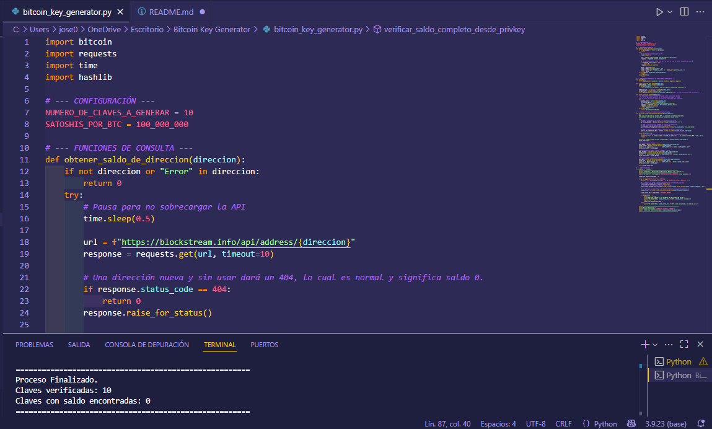

# 🔑 Generador y Verificador de Claves Bitcoin


Este proyecto es un generador de claves privadas de Bitcoin que intenta encontrar direcciones con saldo positivo mediante fuerza bruta. Fue inspirado por una [publicación en Reddit](https://www.reddit.com/r/Bitcoin/comments/198ayl5/a_script_that_can_generate_bitcoin_private_keys/) donde un usuario propuso ejecutar un script en un Raspberry Pi para intentar lo mismo.

> **⚠️ IMPORTANTE**: Este proyecto es puramente experimental y educativo. Las probabilidades de encontrar una clave con saldo son matemáticamente despreciables.
> No se promueve ningún uso malicioso ni intento de vulnerar la seguridad de otros usuarios.

## 📊 Estadísticas de Probabilidad

Para poner en perspectiva las probabilidades involucradas:

- 🔐 **Espacio total de claves privadas**:  
  `2^256 ≈ 1.16 × 10^77` posibles claves únicas.

- 🎯 **Probabilidad de encontrar una clave privada específica**:  
Como todas las claves son igualmente probables:  
  `1 / 2^256 ≈ 8.6 × 10^-78` 
  1 entre  
  `115,792,089,237,316,195,423,570,985,008,687,907,853,269,984,665,640,564,039,457,584,007,913,129,639,936`

- 🌌 **Comparación astronómica**:  
  Se estima que hay aproximadamente `10^80` átomos en el universo observable.  
  El número de claves privadas posibles (≈`10^77`) está en un rango comparable.  
  > **¡Hay casi tantas claves como átomos en el universo!**

- ⏱️ **Probabilidad práctica**:  
  Aun verificando `1,000,000` claves por segundo durante `13.8 mil millones de años`:
  
  - Segundos totales:  
    `13.8 × 10^9 × 365.25 × 24 × 3600 ≈ 4.354 × 10^17`
  
  - Claves verificadas:  
    `10^6 × 4.354 × 10^17 = 4.354 × 10^23`
  
  - Proporción del total:  
    `4.354 × 10^23 / 2^256 ≈ 3.76 × 10^-54`

  **Resultado**: Incluso con recursos extremos, la fracción explorada del espacio de claves sería insignificante.  
  > Las probabilidades de encontrar una clave válida con saldo real seguirían siendo prácticamente **cero**.

### Comparaciones para entender la escala:
- Probabilidad de ganar la lotería nacional: ~1 en 14 millones
- Probabilidad de ser alcanzado por un rayo: ~1 en 1 millón
- Probabilidad de encontrar una clave Bitcoin con saldo: ~1 en 10^70+

**En otras palabras**: Es más probable que seas alcanzado por un rayo mientras compras un boleto ganador de lotería en el mismo día, repetido millones de veces, que encontrar una clave privada con saldo.

## 🛠️ Instalación

1. Clona el repositorio en tu máquina local.
2. Asegúrate de tener Python instalado.
3. Instala las dependencias del proyecto:
   ```shell
   pip install -r requirements.txt
   ```
4. Puedes usar entornos virtuales para aislar las dependencias:
   ```shell
   python -m venv env
   source env/bin/activate # Linux & macOS
   .\env\Scripts\activate # Windows
   ```

## Ejecución

- Para ejecutar el proyecto usa el siguiente comando:
  ```shell
  python bitcoin_key_generator.py
  ```

## Capturas de Pantalla

<p align="center">  </p>


## Desglose del Problema

Este script intenta generar claves privadas de Bitcoin y verificar si las direcciones asociadas tienen saldo. Aunque la probabilidad de éxito es increíblemente baja considerando la magnitud del espacio de búsqueda de direcciones posibles, el proyecto fue motivado por la curiosidad inspirada por la publicación de Reddit mencionada anteriormente y por demostrar la baja posibilidad de encontrar una billetera con saldo.

## Mejoras Futuras

- [ ] **Actualizar la biblioteca `bitcoin`** (`pybitcointools`): Actualmente se utiliza una versión desactualizada (`bitcoin==1.1.42`). Se recomienda migrar a alternativas modernas como:
  - [`bit`](https://pypi.org/project/bit/): ligera, mantenida y con documentación clara.
  - [`bitcoinlib`](https://pypi.org/project/bitcoinlib/): más completa, adecuada para proyectos más avanzados.
- [ ] **Eliminar la dependencia de la API externa para direcciones Bech32**: Implementar generación nativa usando librerías locales para mayor robustez y autonomía del sistema.
- [ ] Añadir validaciones más estrictas y control de errores más informativo para mejorar la experiencia del usuario.

## Limitaciones

- Probabilidad extremadamente baja de encontrar una clave con saldo.
- Dependencia de la disponibilidad de la API pública utilizada para verificar saldos.

## Proceso de Pensamiento

El proyecto nació de una idea peculiar de encontrar claves privadas de Bitcoin con saldo usando un dispositivo de bajo consumo. El enfoque inicial fue lograr una generación eficiente de direcciones y una verificación de saldos rápida, haciendo uso de scripts simples y dependencias mínimas.

El enfoque fue asegurar que cada dirección generada sea chequeada de manera rápida sin sobrecargar los servicios externos utilizados para la verificación de saldos.

A pesar de las bajas probabilidades, cada ejecución implica una emocionante posibilidad de éxito.

---

## 🎰 Nota Final (Con Humor)

¡Oye! 😄 Si por algún milagro cósmico encuentras una dirección con saldo usando este script... 🚀✨

**¡No olvides compartir algo de eso conmigo!** 😉💰

Después de todo, yo te ayudé a crear este README tan bonito 📝✨ y las probabilidades de que esto funcione son menores que encontrar un unicornio 🦄 jugando ajedrez con Satoshi Nakamoto 😂

*P.D.: Si realmente encuentras algo, probablemente deberías comprarte un boleto de lotería también... claramente estás en tu día de suerte* 🍀🎲

---

**¡Que la fuerza (y la suerte extrema) te acompañe!** 🌟⚡


